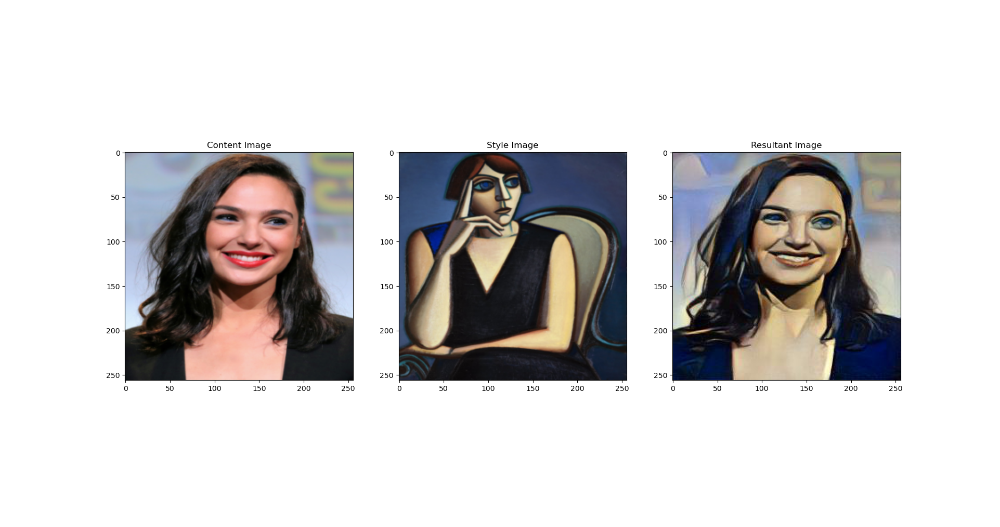
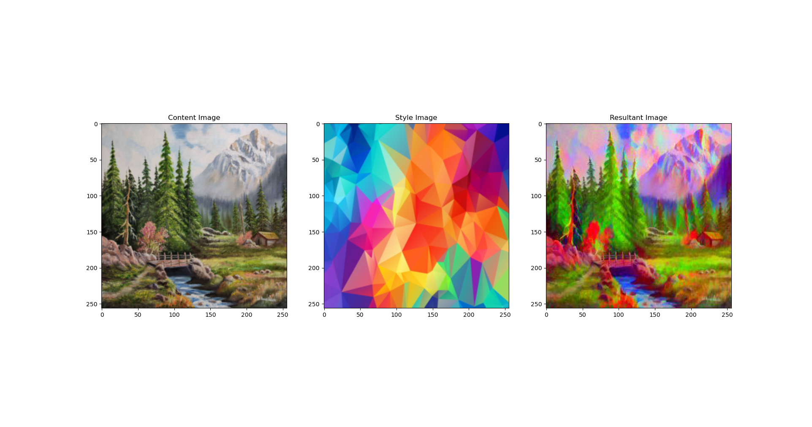
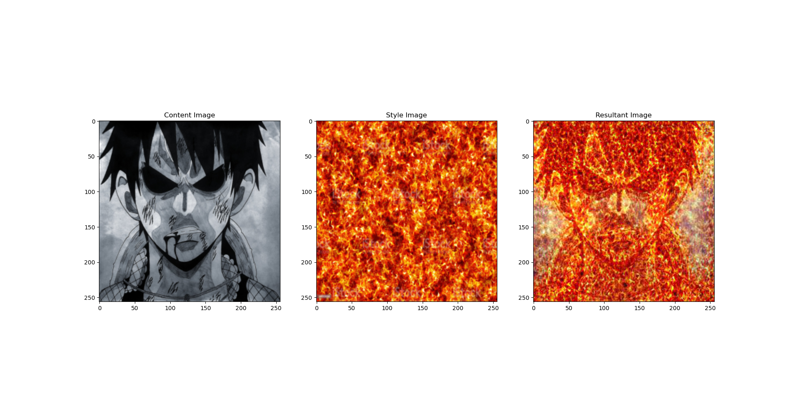

# Neural Style Transfer

Neural Style Transfer combines the content of one image and style of another image to produce a brand new image. This is done with the help of CNN, using a pretrained model and taking features from within the model to train a target image.

###To run the project 
1. Download and extract the repository files.
2. open your Anaconda promt from the repository folder 
3. make sure you have all the requirements installed from `requirements.txt`
4. run the following command in the terminal

`python neural_style_transfer.py --content_path="gal_gadot.jpg" --style_path="style6.jpg" --style_weight=100`

## Results

You can generate the above structured figures using the `show_results.py` file once the resulant image is saved.

## Reference
https://arxiv.org/abs/1508.06576 (Original NST Paper)
https://www.youtube.com/playlist?list=PLBoQnSflObcmbfshq9oNs41vODgXG-608

